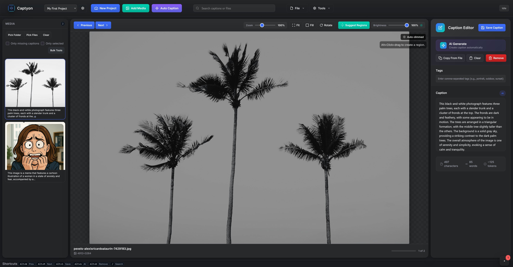
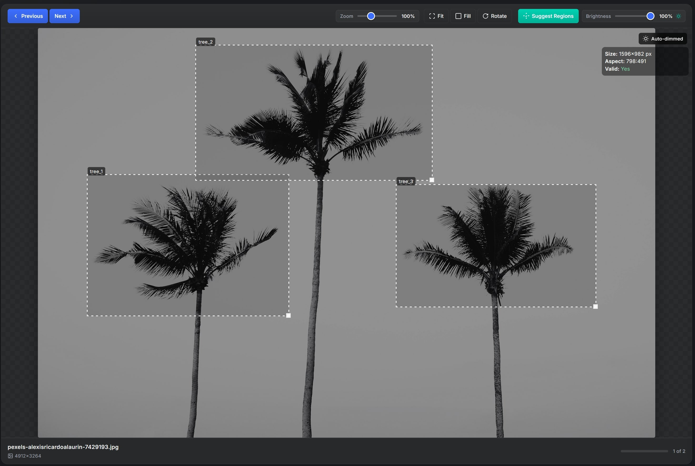

# Captyon 📸

A local-first tool for organizing images and crafting high‑quality captions. Built with **Vue 3**, **TypeScript**, and **Vite** for a fast client experience, plus an optional **Express + MongoDB** server to persist large media via GridFS and enable multi-machine sync.

This README covers installation, configuration, development workflow, API reference, data storage behavior, screenshots, and troubleshooting.

---

## ✨ Features

- Organize image and video items into named projects with captions, tags and metadata.
- Accessibility: automatically dim very bright images to protect users' eyes.
- Local persistence via IndexedDB (works offline).
- Optional server sync using an Express API + MongoDB/GridFS for large media storage.
- Automatic captioning using a local Ollama model (optional).
- Prompt metadata extraction (Stable Diffusion prompts stored in image metadata).
- Bulk caption utilities: add prefixes/suffixes, find & replace across many captions.
- Import folders or JSON project exports; export projects as JSON or ZIP (media + captions).
- Video support: preview thumbnails; videos can be skipped during auto-captioning.
- Cropping & region selection tools for focused captioning and curation.
- Curation workflow components for reviewing and accepting suggested captions.
- Server includes CORS, rate-limiting, optional API key authentication, and GridFS media storage.

---

## Screenshots

Main UI  


Region selection / cropping overlay  


---

## Quickstart (local development)

1. Clone the repo:
   ```bash
   git clone https://github.com/captyon/captyon.git
   cd captyon
   ```

2. Install dependencies (root installs both client and server dependencies via the lockfile):
   ```bash
   npm install
   ```

3. Start development mode (runs client + server concurrently):
   ```bash
   npm run dev
   ```
   - Client: http://localhost:5173 (Vite)
   - Server: http://localhost:4000 (Express)

You can also run the client or server independently:
- Client only:
  ```bash
  npm run dev:client
  ```
- Server only (from project root):
  ```bash
  npm run dev:server
  ```
  or from `server/`:
  ```bash
  cd server && npm run dev
  ```

---

## Prerequisites

- Node.js (v18+ recommended)
- npm
- (Optional) MongoDB instance for server sync (local or remote)
- (Optional) Ollama or other local model if you plan to use automatic captioning

---

## Configuration (.env)

A sample environment file is provided at `server/.env.example`. Copy it to `server/.env` and edit as needed.

Important variables:

- MONGODB_URI — MongoDB connection string (example: `mongodb://localhost:27017/captyon`)
- PORT — API server port (default `4000`)
- CORS_ORIGINS — comma-separated allowed origins (example: `http://localhost:5173`)
- API_KEY — optional server API key. If set, clients must send `Authorization: Bearer <key>` or `x-api-key` header.
- VIDEO_MAX_SIZE_MB — maximum allowed inline video size (MB); default: `5`

Example:
```env
MONGODB_URI=mongodb://localhost:27017/captyon
PORT=4000
CORS_ORIGINS=http://localhost:5173
API_KEY=
VIDEO_MAX_SIZE_MB=5
```

Security note: If you expose the server to the public internet, set an API key and configure CORS to restrict clients.

---

## Available scripts

Root package.json (project root):
- `npm run dev` — concurrently runs server dev and client (runs `dev:server` + `dev:client`)
- `npm run dev:server` — runs server dev (delegates to `server/` scripts)
- `npm run dev:client` — starts Vite dev server
- `npm run build` — typecheck (vue-tsc) and build client
- `npm run preview` — preview built client

Server (server/package.json)
- `npm run dev` — runs `ts-node-dev` against `server/src/index.ts` (development)
- `npm run build` — compiles TypeScript to `dist/`
- `npm run start` — runs compiled server (`node dist/index.js`)

---

## Architecture & project structure

Top-level layout (important folders):
```
.
├─ src/            # Vue 3 front-end (client)
├─ server/         # Express + MongoDB API (optional)
├─ public/         # Static assets (client)
├─ screenshots/    # Project screenshots (included in this README)
```

Key server files:
- `server/src/index.ts` — Express app bootstrap and middleware
- `server/src/routes/projects.ts` — API endpoints to manage projects and files (GridFS handling)
- `server/src/models/project.ts` — Mongoose schema for stored projects

Key client files:
- `src/components/CaptionStudio.vue` — main UI component
- `src/components/caption-studio/*` — UI sub-components (Viewer, Editor, Toolbar, modals)
- `src/store/useProjectStore.ts` — client-side project persistence and sync logic
- `src/services/*` — services (DB wrappers, Ollama integration, etc.)
- `src/utils/file.ts` — import/export helpers
- `src/config/cropping.ts` — cropping and region defaults

---

## API Reference

Base URL: `http://localhost:<PORT>` (default: 4000)

All endpoints return JSON unless otherwise noted.

1) GET /projects/meta  
- Description: Returns metadata for all projects: `{ id, name, count, updatedAt }[]`  
- Example:
  ```bash
  curl http://localhost:4000/projects/meta
  ```

2) GET /projects/:id  
- Description: Returns the full project document. If items only reference GridFS files via `imgId` and do not have inline `img` data, the server will attempt to hydrate small thumbnails (data URLs) from GridFS and embed them in the response so the client can render thumbnails without separate requests.  
- Example:
  ```bash
  curl http://localhost:4000/projects/my-project-id
  ```

3) PUT /projects/:id  
- Description: Upsert a full project document. The client typically sends the entire project object (including items). The server:
  - Validates payload `id` matches URL.
  - Scans items for inline base64 media and, when MongoDB is available, stores large media in GridFS and replaces inline data with `imgId`, keeping a small thumbnail inline.
  - Performs a pre-check to reject inline videos larger than `VIDEO_MAX_SIZE_MB`.
  - Cleans up previously stored GridFS files that are no longer referenced.
- Payload: full project object (JSON).
- Example:
  ```bash
  curl -X PUT -H "Content-Type: application/json" \
    -d @project.json \
    http://localhost:4000/projects/my-project-id
  ```

4) GET /projects/files/:id  
- Description: Streams a file stored in GridFS by file id. The server attempts to set `Content-Type` and `Content-Disposition` (inline; filename="...") based on GridFS metadata.
- Example:
  ```bash
  curl http://localhost:4000/projects/files/64b...abc > image.jpg
  ```

5) DELETE /projects/:id  
- Description: Deletes the project document and attempts to delete any GridFS files referenced by it. If GridFS deletion fails for some files, the server logs a warning but proceeds to delete the project document.

Authentication & Rate Limiting:
- If `API_KEY` is set in `server/.env`, the server expects requests to include `Authorization: Bearer <key>` or `x-api-key: <key>`.
- The server includes rate limiting and basic security (`helmet`) middleware by default.

---

## Storage & GridFS behavior (server-side details)

- Goal: avoid large MongoDB document sizes by storing full media in GridFS and keeping lightweight thumbnails inline or small placeholders.
- When PUT receives items:
  - The server detects inline data URLs (`data:<mime>;base64,<data>`) or raw base64 strings.
  - If the inline base64 length is > 8KB (8192) or the string isn't a proper data URL, the server will consider it for GridFS storage.
  - For images: the server uses `sharp` to generate a thumbnail (width 600px, without enlargement). The thumbnail is kept inline (`item.img = data:<mime>;base64,...`) while the full file is uploaded to GridFS and referenced as `item.imgId`.
  - For non-image media (video): the server stores the full buffer in GridFS and keeps a minimal placeholder thumbnail inline. There's a configurable server-side pre-check to reject inline videos larger than `VIDEO_MAX_SIZE_MB`.
  - If MongoDB/GridFS is not available, the server will truncate overly large inline blobs to a safe size (approx 10KB).
- Cleanup:
  - On PUT, after storing the new project, the server attempts to delete any GridFS files that were referenced by the previous project but are no longer referenced in the updated payload.
  - On DELETE project, the server attempts to delete all GridFS files referenced by the project.

Implications for client:
- When GET /projects/:id returns items:
  - Items may have `img` (inline data URL) for thumbnails, and `imgId` for the full file in GridFS.
  - The client can directly render the inline `img`. To fetch the full original file, request `/projects/files/:imgId`.
  - If an item has only `imgId` and no inline `img`, the server tries to hydrate a thumbnail before returning; if hydration fails the client can call `/projects/files/:imgId` to retrieve the file and generate thumbnails locally.

---

## Client features & usage notes

- Local-first: while editing, projects are cached in IndexedDB so you can work offline. When a server is configured, you can sync projects up to the server.
- Import:
  - Drag & drop a folder or import JSON exports to restore a project.
  - Image metadata extraction will attempt to pull Stable Diffusion prompt text embedded in images (if present) to use as suggested captions.
- Export:
  - Export a single project as JSON.
  - Export as a ZIP containing images plus captions for portability and backups.
- Bulk operations:
  - Apply a prefix or suffix to multiple selected captions.
  - Run find & replace over a subset or all captions.
- Automatic captioning:
  - If you run a local Ollama model and configure the client to use it, auto-captioning can generate captions for images. Streaming responses are supported where available.
- Cropping & regions:
  - Use the crop overlay to define regions of interest; captioning and curation tools can operate on selected regions rather than the whole image.
- Video handling:
  - Video items can include thumbnails; automatic captioning can be skipped for video items.
  - Server enforces `VIDEO_MAX_SIZE_MB` for inline video uploads to prevent huge payloads.

---

## Development tips

- The repo uses a simple monorepo arrangement: the client root is the repo root, and the server lives under `server/`.
- Debugging server: `npm run dev:server` will run the server with `ts-node-dev` and auto-restart on changes.
- Debugging client: `npm run dev:client` (or `npm run dev` to run both).
- To build for production:
  1. `npm run build` — builds client (and runs TypeScript check).
  2. `cd server && npm run build && npm run start` — compile and run server (if you intend to serve API in production).
- If using a process manager in production (pm2, systemd), prefer serving the static client assets from a CDN or a web server and keep the server API behind a secure firewall.

---

## Troubleshooting

- "Server not available / CORS error":
  - Ensure `CORS_ORIGINS` in `server/.env` includes the client origin (http://localhost:5173).
  - Check server logs for startup errors (DB connection, port already in use).
- "PUT failing with payload id mismatch":
  - The server requires the payload `id` to match the `:id` path parameter. Ensure the client sends the correct project id.
- "Large uploads failing / BSON size issues":
  - Check the server logs for GridFS processing errors. If no MongoDB is connected, the server truncates large blobs; use a MongoDB instance for full media support.
- "Thumbnails missing from GET /projects/:id":
  - The server attempts to hydrate thumbnails from GridFS. If that fails, call `/projects/files/:imgId` to fetch the original and generate thumbnails locally, or check GridFS file existence.

---

## Contributing

Contributions are welcome. Suggested workflow:
1. Fork the repo and create a feature branch.
2. Open a PR with a clear description and include screenshots for UI changes.
3. Keep changes scoped and include tests where relevant.

Please follow the existing TypeScript and Vue 3 patterns. The repo uses `vue-tsc` for type checking.

---

## License & acknowledgements

- Captyon Non-Resale Attribution License (see `LICENSE` file.)
- Thanks to the open-source ecosystem: Vue, Vite, Express, MongoDB, Sharp, and others.

---

Enjoy editing captions and organizing your media with Captyon!
